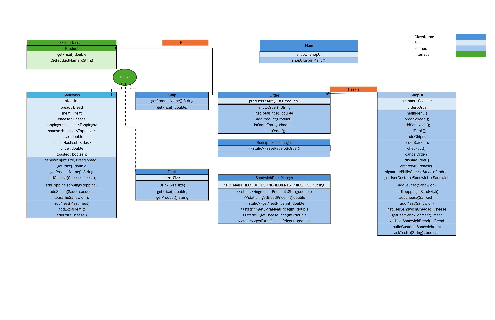
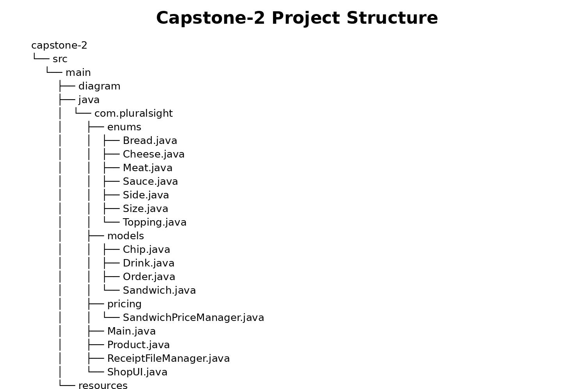

# 🥪 DELI-cious Sandwich Shop Application

## OverView
The DELI-cious Sandwich Shop Application is a command-line interface (CLI) Java application that allows users to place and customize sandwich orders.  
Users can build sandwiches, add drinks and chips, review their order, and generate a receipt saved as a file.

The application demonstrates Object-Oriented Programming (OOP) concepts such as abstraction, encapsulation, and polymorphism, along with file handling for data persistence.

---

## Features

- Create a new order
- Add sandwiches with full customization:
    - Choose size (4", 8", 12")
    - Select bread type
    - Add meats and cheeses (with extra options)
    - Add toppings and sauces
    - Add sides
    - Option to toast the sandwich
- Add drinks (small, medium, large)
- Add chips
- View complete order details
- Calculate total price
- Generate and save receipt as a `.txt` file
- Set Sandwich ingredients price form a `.csv` file

---

## How to Run the Application

1. Open the repository URL on GitHub
2. Clone or download the repository
3. Open the project in IntelliJ
4. Run the `Main` class
5. Follow the on-screen menu prompts

---
## Project Diagram

---
## Project Structure

---

## Receipt File Format

Receipts are saved in the following format inside the resources' folder:
   

    "yyyyMMdd-HHmmss.txt"

Example:
20260526-153045.txt

Receipt content includes:
- List of ordered items
- Individual product details
- Total price 

---
## Sandwich Price Manager
Prices for sandwich ingredients are set from a `.csv` file.

The `.csv` file is following format:

    SIZE_4_BREAD_PRICE,5.50
    SIZE_4_MEAT_PRICE,1
    SIZE_4_EXTRA_MEAT_PRICE,0.5
    SIZE_4_CHEESE_PRICE,0.75
    SIZE_4_EXTRA_CHEESE_PRICE,0.3
    SIZE_8_BREAD_PRICE,7
    SIZE_8_MEAT_PRICE,2
    SIZE_8_EXTRA_MEAT_PRICE,1
    SIZE_8_CHEESE_PRICE,1.5
    SIZE_8_EXTRA_CHEESE_PRICE,0.6
    SIZE_12_BREAD_PRICE,8.5
    SIZE_12_MEAT_PRICE,3
    SIZE_12_EXTRA_MEAT_PRICE,1.5
    SIZE_12_CHEESE_PRICE,2.25
    SIZE_12_EXTRA_CHEESE_PRICE,0.90

Each line represents a key-value pair where:

The key defines the sandwich size and ingredient type.
The value represents the price for that specific item.

This approach allows prices to be easily updated without changing the code.

##### Sandwich File Manager Limitation: 
- The .csv file must follow the exact KEY,VALUE format and include all required entries.
- Only predefined sandwich sizes and price types are supported.
- There is minimal validation, so incorrect or missing data can cause errors or inaccurate pricing.
- The file must be accessible at the correct path for the system to load successfully.

---
## Limitations

- Command-line based user interface
- Fixed file path for receipts
- Limited input validation for invalid user input

---

## Future Improvements

- Improve input validation and error handling
- Add graphical user interface (GUI)
- Add signature sandwich templates and customization options
- Enhance receipt formatting for better readability

---

## Author

This project was created as part of a Java capstone assignment to demonstrate Object-Oriented Programming, clean code practices, and file handling.

I approached this project by first designing the overall structure using OOP principles and separating responsibilities across different classes such as UI, order management, and product handling.  
During development, I focused on keeping the code organized by using clear method names, and consistent formatting.

One of the main improvements in this project was applying a cleaner architecture by separating user interaction from business logic, which made the code easier to read, maintain, and extend.

Working on this project helped strengthen my understanding of Java concepts such as interfaces, class relationships, control flow, and file input/output operations.

---
